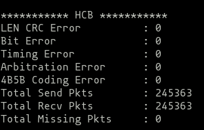
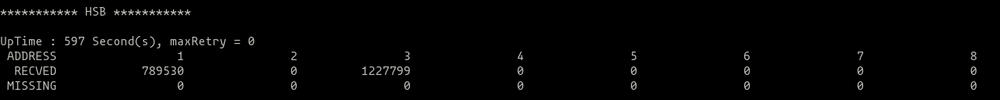
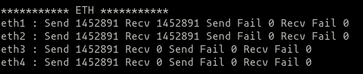
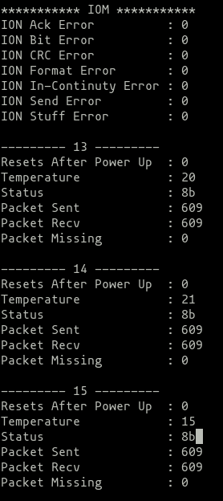
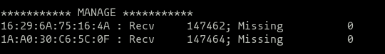
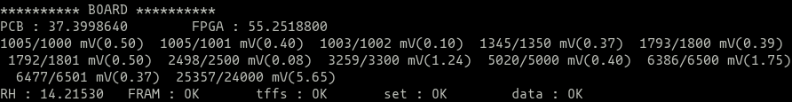
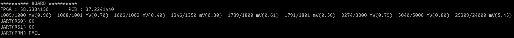
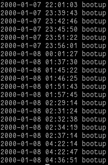
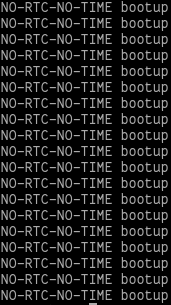

# 测试程序说明
## 测试程序运行
测试程序上电后在5秒钟内完成初始化并开始运行。因此请至少等待10秒钟再对当前运行数据进行获取，否则数据获取操作会失败，早于此时的统计数据并没有意义。
## 测试程序的测试项
目前测试程序主要对如下项进行测试：
1. 背板总线
  * HCB
  * HSB
  * ION（主要用于状态获取，并不作实际作为测试）
2. 板载监视
  * 电压监视
  * 温度监视
  * 湿度监视
3. 板载部分功能测试
  * 铁电
  * IRIGB
  * NOR上文件系统（隐含了对NOR的测试）
  * eMMC上文件系统（隐含了对eMMC的测试）
  * RS232（仅HMI板支持，且该测试仅输出一串字符，依赖于人工对输出的RS232数据进行获取.目前由于RS232输出依赖于CTS信号，因此需要正确端接该CTS信号后方能够正常输出）
  * RS485（仅HMI板，且该测试仅输出一串字符，依赖于人工对输出的数据进行获取）
  * 小面板以太网回环测试（仅HMI板支持，为单网口回环，即单个RJ45以太网水晶头上将第一对交叉线和第二对交叉线短接）
4、单板复位监视
# 测试数据获取
## telnet连接方法
### 连接方式
测试数据的获取依赖于telnet的连接。目前，CPU板在小面板引出了RJ45接口可用于telnet连接；HMI板利用前面板以太网接口，通过PNL板的以太网交换芯片实现连接。
### IP地址
目前IP地址固定为：100.100.100.100
## 测试数据获取方式
测试程序运行后，将定期（目前为30秒）向控制台以及装置上/tffs/log文件中输出当前的测试结果。
在telnet下，亦可以通过直接输入test_show得到当前的测试结果。
# 测试数据解读
## HCB部分

HCB部分表示该模件的HCB总线工作状态统计。统计项依次为：
1. HCB报文长度或CRC出错
2. HCB报文出现位错误
3. HCB报文的时序出错
4. HCB总线长时间无法获取发送权限
5. HCB报文出现编码错误
6. HCB总线发送报文数
7. HCB总线接收报文数
8. HCB总线发出后未能够回环接收的报文数
1-5应当为0，6与7的数量应当相同，8应当为0方为正确状态。

## HSB部分

HSB部分表示该模件对当前装置的HSB总线工作状态统计。统计项依次为：
1. 当前单板的启动时间（UpTime）以及最大HSB的发送重试次数（maxRetry）
2. 列出当前支持的所有HSB总线节点地址，目前为1～8
3. 列出对应节点所发出并被该节点正确收到的HSB总线报文
4. 列出对应节点发出但未被收到的HSB总线报文

MISSING应当均为0。

## ETH部分

该部分用于对HMI的小面板4个MMS口进行回环测试
每行数据内容依次为：

*名称：发送包数 接收包数 发送失败次数 接收失败次数*

正常情况下，前两项应当相同，后两项应当为0。
目前以太网的回环测试为单网口自身回环，即RJ45的第一对交叉线与第二对回环连接。

## IOM部分

IOM部分包含了对模件的ION的状态以及装置内各ION设备的状态的获取。

### IOM

该部分统计了该单板ION的总线工作状态，依次为：
1. 无应答错误计数
2. 位错误计数
3. CRC错误计数
4. 格式错误计数
5. 接收报文不连接错误计数
6. 发送错误计数
7. 报文填零错误计数
所有计数应当均为0。

### 各IO板

表示该模件通过ION总线与板在IO板进行数据通讯后，获取由IO板上传的MCU节温以及上电后的复位次数以及ION总线本身的数据统计。统计项依次为：
1. IO模件上电后的复位次数（每30秒更新一次，该数据亦仅表示最近30秒内的上电复位次数，IO模件上电后前30秒该数据不刷新）
2. IO模件当前MCU的温度（每1秒更新一次）
3. IO模件的当前工作状态（由IO板上送，具体需要参见IO板协议）
4. ION总线发送报文数量
5. ION总线接收报文数量
6. ION总线收、发报文差异

上述中，在上电30秒后统计项1才会被首次刷新，才会有意义；统计项2为IO板的MCU的节温，4与5的数据应当相同，6在正确时应当为0。

### 开出测试

如需要对某一开出板的开出进行测试，需要在Telnet下输入如下命令：

*-> ion_do_test(addr,active_time)*

其中，addr为开出板的节点地址，active_time为需要开出使能的时间（秒），默认为10秒。即ion_do_test(12, 0)将会使能12号位置的DO板的所有开出节点10秒后返回。

## MANAGE部分

MANAGE部分是表示当前主、子机之间的通讯状态。

第一列为该单板接收到所有单板（包括自身）发送的报文的源地址，该部分用于区别不同单板发出的报文；

第二列为接收到连接报文的总数；

第三列为通过序号不连接算出的丢帧数，正确时应当为0。

*注：主、机子必须同时上、下电方能够保证该部分计数工作正常，单独对主机或子机进行复位后，未复位的装置将会出现MISSING的计数出错的现象。* 

## BOARD部分

第一行为当前板上所有的温度传感器的数据，FPGA是指ZYNQ的内部节温，PCB是指板上温度传感器的读数。

第二行为当前板上所有的电压监视的数据。其构成为：

*测得电压/标准电压（偏差值）*

测得电压为当前系统内部测得的电压值，标准电压为其设计目标电压。

第三行开始会有额外的对RS485以及RS232的测试结果，每一个测试结果占用一行，应当均为OK。如RS232的CTS线未被正常连接，RS232在上电后FIFO写满将返回FAIL。

*注：仅HMI*

最后一行是一些小功能的监视，主要包含：

1. RH：湿度
2. FRAM：对FRAM的读写测试功能是否正常，应当为OK
3. tffs：/tffs文件系统是否正常工作
4. set：/set文件系统是否工作正常
5. data：/data文件系统是否工作正常
6. RTC：当前RTC是否能够正常读写（仅HMI）
7. IRIGB：当前IRIGB是否工作正常（仅HMI）

## 上电复位监视
在单板上电后，测试程序将向文件系统写入一条上电记录。该上电记录文件为”/tffs/boot.log”。

通过FTP下载该文件即可根据的记录条数判断该单板在清零后的上电次数。

该文件通常看起来如下：

针对于CPU板，由于没有RTC的存在，上述记录看起来是这样的：

该记录的条数即为该单板的复位次数。由于上电复位亦计算在内，因此仅有一条记录时为一个正常的上电记录。
删除该文件即实现了对上电记录的清零。

